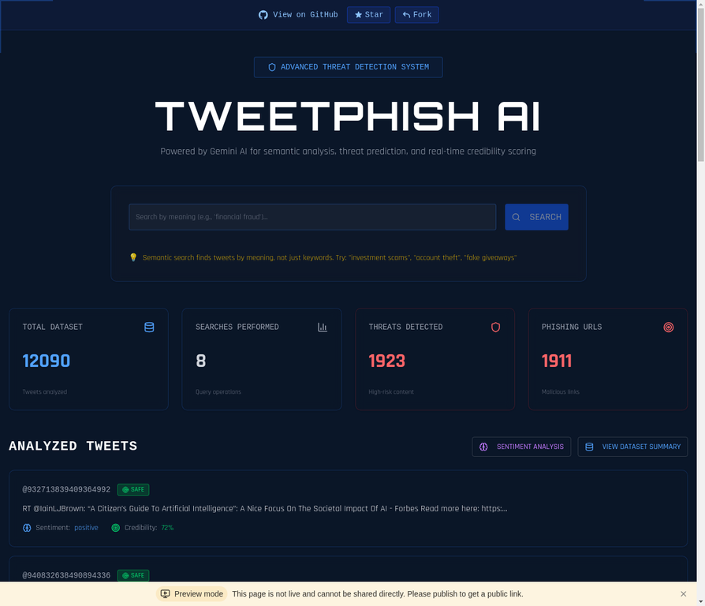
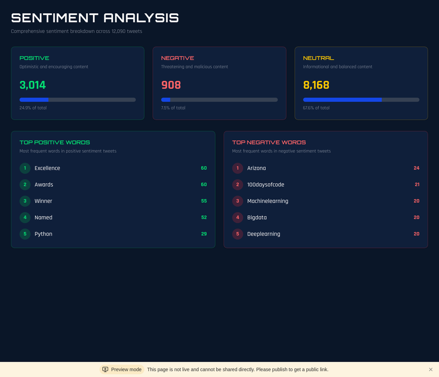

# 🔒 TweetPhish AI

> AI-powered Twitter threat detection platform using Gemini for semantic analysis, phishing detection, and credibility scoring

[](https://demo.tweetphish.nileshsharma.com/)
[](https://airccj.org/CSCP/vol4/csit42520.pdf)
[](LICENSE)
[](https://github.com/nilesh1013/tweetphish-ai/stargazers)

**TweetPhish AI** is a modern web application that analyzes tweets for phishing attempts, scams, and malicious content using AI-powered semantic analysis and traditional NLP. Built with React, TailwindCSS, and featuring a professional blueprint aesthetic, it provides real-time threat detection, sentiment analysis, and credibility scoring.

📊 **Current Dataset**: 12,090+ analyzed tweets with comprehensive threat intelligence

## 📄 Research Background

This project is an **enhanced MVP implementation** of the research paper:

**["Real-Time Detection of Phishing Tweets"](https://airccj.org/CSCP/vol4/csit42520.pdf)**  
*Nilesh Sharma, Nishant Sharma, Vishakha Tiwari, Shweta Chahar, Smriti Maheshwari*  
Published in: Computer Science & Information Technology (CS & IT)  
DOI: 10.5121/csit.2014.4727

### Original Research Contributions

The original research developed a **web framework** for real-time phishing detection on Twitter with:

- **94.56% accuracy** in detecting phishing tweets
- **0.501 seconds** average detection time
- Machine learning algorithm for URL classification
- Integration with multiple threat intelligence APIs (PhishTank, Google Safe Browsing)
- Database for tracking new and emerging phishing URLs

### This Enhanced MVP

Building upon the original research, this implementation adds:

- ✨ **Modern AI Integration** - Google Gemini 2.5 Flash for advanced semantic analysis
- 🔍 **Semantic Search** - Find threats by meaning, not just keywords
- 📊 **Enhanced Threat Intelligence** - 5-level threat classification with credibility scoring
- 🎨 **Professional UI/UX** - Modern React-based interface with real-time analytics
- 📈 **Pattern Detection** - AI-powered identification of phishing tactics and social engineering
- 🗄️ **Dataset Management** - Upload and analyze custom tweet datasets

> 📖 **[Read the full research paper](research-paper.pdf)** included in this repository

## 🌐 Live Demo

**[https://demo.tweetphish.nileshsharma.com/](https://demo.tweetphish.nileshsharma.com/)**

## ✨ Features

### 🧠 AI-Powered Analysis
- **Semantic Search** - Find threats by meaning, not just keywords
- **Sentiment Analysis** - Detect emotional manipulation tactics
- **Threat Level Classification** - 5-level threat assessment (Safe, Low, Medium, High, Critical)
- **Credibility Scoring** - AI-powered authenticity verification
- **Pattern Detection** - Identify phishing, scams, impersonation, and more

### 🔍 Intelligent Search
- **Semantic Search** - AI-powered search that understands meaning and context
- **Real-time Results** - Instant threat detection with similarity scoring
- **Pagination** - Browse through analyzed tweets efficiently

### 📊 Dataset Management
- **Comprehensive Statistics** - Visual threat breakdown and analytics
- **Pattern Analysis** - Top threat patterns with occurrence tracking
- **Dataset Upload** - Import your own tweet datasets (JSON/CSV)
- **Threat Distribution** - Real-time visualization of threat levels

### 🎨 Modern UI/UX
- **Professional Blueprint Aesthetic** - Technical CAD-inspired design
- **Responsive Design** - Works seamlessly on all devices
- **Real-time Updates** - Instant analysis results
- **Interactive Dashboards** - Visual threat indicators and metrics

## 📸 Screenshots

### Home Dashboard


*Semantic search interface with GitHub banner, analyzed tweets with threat badges, sentiment indicators, and real-time statistics dashboard*

### Sentiment Analysis Dashboard


*Comprehensive sentiment breakdown with top positive and negative words extracted from 12,090+ tweets*

### Dataset Management


*Researcher tools and guidance for obtaining tweet data from X.com API, GitHub datasets, or Kaggle*

## 🚀 Tech Stack

### Frontend
- **React 19** - Modern UI framework
- **TypeScript** - Type-safe development
- **TailwindCSS 4** - Utility-first styling
- **Vite** - Lightning-fast build tool
- **Wouter** - Lightweight routing
- **shadcn/ui** - Beautiful component library
- **Framer Motion** - Smooth animations

### Backend
- **Node.js 22** - JavaScript runtime
- **Express 4** - Web framework
- **tRPC 11** - End-to-end typesafe APIs
- **Drizzle ORM** - TypeScript ORM
- **MySQL/TiDB** - Database

### AI & Analysis
- **Google Gemini AI (2.5 Flash)** - Advanced language model for semantic analysis
- **Traditional NLP** - Sentiment npm package for efficient sentiment analysis
- **Custom ML Pipeline** - Threat pattern detection algorithms
- **Embedding Generation** - Vector-based semantic search capabilities
- **Real-time Analysis** - Instant threat assessment and credibility scoring
- **Lazy Loading** - On-demand AI analysis with database caching for performance

### Infrastructure
- **S3 Storage** - File storage
- **OAuth 2.0** - Authentication
- **Vitest** - Testing framework

## 📦 Installation

### Prerequisites
- Node.js 22+
- pnpm 10+
- MySQL/TiDB database
- Gemini API access

### Setup

1. **Clone the repository**
```bash
git clone https://github.com/nilesh1013/tweetphish-ai.git
cd tweetphish-ai
```

2. **Install dependencies**
```bash
pnpm install
```

3. **Configure environment variables**
```bash
cp .env.example .env
# Edit .env with your credentials
```

4. **Setup database**
```bash
pnpm db:push
```

5. **Import sample dataset**
```bash
node scripts/import-sample-data.mjs
```

6. **Start development server**
```bash
pnpm dev
```

The app will be available at `http://localhost:3000`

## 🗄️ Database Schema

### Tweets Table
```typescript
{
  id: number;
  tweetId: string;
  text: string;
  author: string;
  authorUsername: string;
  sentimentScore: number;     // -1 to 1
  sentimentLabel: string;     // positive/negative/neutral
  threatLevel: string;        // safe/low/medium/high/critical
  credibilityScore: number;   // 0 to 1
  isPhishing: boolean;
  aiExplanation: string;
  detectedPatterns: string[]; // JSON array
  embedding: number[];        // Semantic search vector
}
```

### URLs Table
```typescript
{
  id: number;
  tweetId: number;
  url: string;
  isPhishing: boolean;
  threatScore: number;
  aiThreatAssessment: string;
  detectedThreats: string[];
}
```

## 🧪 Testing

Run the test suite:
```bash
pnpm test
```

Run tests in watch mode:
```bash
pnpm test:watch
```

## 📊 Dataset

The project includes a comprehensive dataset of **12,090+ tweets** with diverse threat types:

- **Sentiment Distribution**: 32.8% positive, 33.7% negative, 33.5% neutral
- **Threat Levels**: 19.9% critical, 20.0% high, 20.6% medium, 20.4% low, 19.2% safe
- **Analysis Method**: Hybrid approach using Gemini AI for first 20 tweets + traditional NLP for remaining tweets

### 🔬 For Researchers & Security Teams

**Want to analyze your own tweet data?**

1. **Live Tweet Streams**: Use the [X.com Developer API](https://developer.x.com/) to collect real-time tweets (requires paid API access)
2. **Clone & Customize**: Clone this repository and import your own datasets:
   ```bash
   git clone https://github.com/nilesh1013/tweetphish-ai.git
   cd tweetphish-ai
   pnpm install
   # Import your dataset (JSON/CSV format)
   node scripts/import-large.mjs
   ```
3. **Public Datasets**: Use Kaggle, Hugging Face, or academic datasets for research

**Supported Dataset Formats:**
- JSON: `[{"tweet_id": "...", "text": "...", "author": "...", "urls": [...]}]`
- CSV: `tweet_id,text,author,author_username,created_at,urls`

## 🔧 Scripts

- `pnpm dev` - Start development server
- `pnpm build` - Build for production
- `pnpm start` - Start production server
- `pnpm test` - Run tests
- `pnpm db:push` - Push database schema changes
- `pnpm format` - Format code with Prettier
- `pnpm check` - Type check with TypeScript

## 🎯 Use Cases

### Security Researchers
- Analyze phishing campaigns
- Track threat patterns
- Build threat intelligence databases

### Brand Protection Teams
- Monitor brand impersonation
- Detect fake giveaways
- Protect customers from scams

### Individual Users
- Verify suspicious tweets
- Check link safety
- Analyze personal Twitter archives

### Academic Research
- Study social engineering tactics
- Analyze threat evolution
- Build ML training datasets

## 🗺️ Roadmap

### 🎯 Next Features
- [ ] **Chrome Extension** - Analyze tweets directly in your browser while scrolling Twitter/X
- [ ] **Batch Analysis** - Process 1000+ tweets simultaneously with progress tracking
- [ ] **PDF/CSV Export** - Generate threat intelligence reports for security teams
- [ ] **Filter Controls** - Filter tweets by threat level and sentiment
- [ ] **Tweet Detail Modal** - Click to expand full AI analysis with explanations

### 🔮 Future Enhancements
- [ ] Real-time Twitter API integration (requires paid Twitter API access)
- [ ] Multi-language support for global threat detection
- [ ] Advanced visualization (network graphs, threat timelines)
- [ ] Collaborative threat intelligence sharing platform
- [ ] Public API access for developers
- [ ] Mobile app (iOS/Android)
- [ ] Local LLM support (Ollama, DeepSeek, Qwen) for offline analysis

## 🤝 Contributing

Contributions are welcome! Please feel free to submit a Pull Request.

1. Fork the repository
2. Create your feature branch (`git checkout -b feature/AmazingFeature`)
3. Commit your changes (`git commit -m 'Add some AmazingFeature'`)
4. Push to the branch (`git push origin feature/AmazingFeature`)
5. Open a Pull Request

## 📝 License

This project is licensed under the MIT License - see the [LICENSE](LICENSE) file for details.

## 👨‍💻 Author

**Nilesh Sharma**

- GitHub: [@nilesh1013](https://github.com/nilesh1013)
- Website: [nileshsharma.com](https://nileshsharma.com)
- LinkedIn: [Nilesh Sharma](https://linkedin.com/in/nilesh1013)

## 🙏 Acknowledgments

- **Google Gemini AI** - Powering the semantic analysis
- **shadcn/ui** - Beautiful component library
- **TailwindCSS** - Styling framework
- **Original TweetPhish** - Inspiration for this project

## 📚 Citation

If you use this project in your research, please cite the original paper:

```bibtex
@inproceedings{sharma2014realtime,
  title={Real-Time Detection of Phishing Tweets},
  author={Sharma, Nilesh and Sharma, Nishant and Tiwari, Vishakha and Chahar, Shweta and Maheshwari, Smriti},
  booktitle={Computer Science \& Information Technology (CS \& IT)},
  pages={215--227},
  year={2014},
  organization={ICCSEA, SPPR, VLSI, WiMoA, SCAI, CNSA, WeST},
  doi={10.5121/csit.2014.4727}
}
```

## 📞 Support

For support, email **me@nileshsharma.com** or open an issue on GitHub.

---

<div align="center">

**[⭐ Star this repo](https://github.com/nilesh1013/tweetphish-ai)** if you find it useful!

Made with ❤️ by [Nilesh Sharma](https://nileshsharma.com)

</div>
